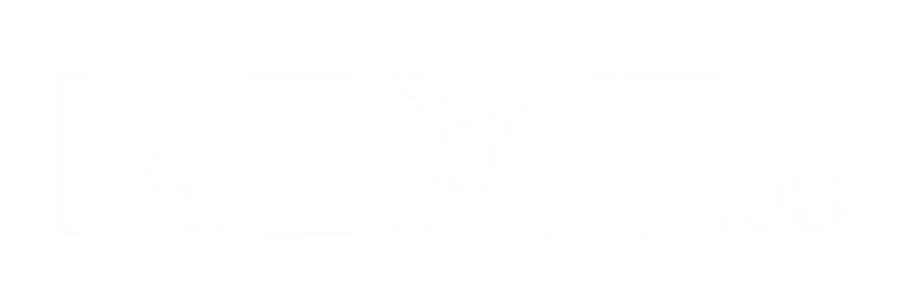

# 
Hi 👋, I'm Egor

### 
Fullstack Developer 🚀

    

### Welcome to my GitHub! Below you will find information about my skills, projects, and how to contact with me.

## 🛠️ My Tech Stack

### Programming languages

     &nbsp;&nbsp;&nbsp;&nbsp;
     &nbsp;&nbsp;&nbsp;&nbsp;
     &nbsp;&nbsp;&nbsp;&nbsp;
    

### Major skills with rich experience 🔥

     &nbsp;&nbsp;&nbsp;&nbsp;
     &nbsp;&nbsp;&nbsp;&nbsp;
     &nbsp;&nbsp;&nbsp;&nbsp;
     &nbsp;&nbsp;&nbsp;&nbsp;
     &nbsp;&nbsp;&nbsp;&nbsp;
     &nbsp;&nbsp;&nbsp;&nbsp;
     &nbsp;&nbsp;&nbsp;&nbsp;
     &nbsp;&nbsp;&nbsp;&nbsp;
     &nbsp;&nbsp;&nbsp;&nbsp;
    

### Skills with minor experience 🌱

     &nbsp;&nbsp;&nbsp;&nbsp;
     &nbsp;&nbsp;&nbsp;&nbsp;
     &nbsp;&nbsp;&nbsp;&nbsp;
     &nbsp;&nbsp;&nbsp;&nbsp;
     &nbsp;&nbsp;&nbsp;&nbsp;
     &nbsp;&nbsp;&nbsp;&nbsp;
     &nbsp;&nbsp;&nbsp;&nbsp;
     &nbsp;&nbsp;&nbsp;&nbsp;
    

### Soft skills and hobbies
#### <ul>
####     <li>Teamwork</li>
####     <li>Fast learner</li>
####     <li>Passion for learning new technologies</li>
####     <li>Music</li>
####     <li>Sport</li>
####     <li>Sense of humor</li>
#### </ul>

## 🤝 Feel free to contact with me
### I am glad that you visited my GitHub profile, if you have an interesting idea or suggestion for me, you can easily contact me via:
#### <ul>
####     <li>Telegram: <a href="https://t.me/Egor_Leontev24">Egor_Leontev24</a></li>
####     <li>Email: <a href="mailto:egorleontev54@gmail.com?subject=Вопрос по сотрудничеству&body=Здравствуйте!">egorleontev54@gmail.com<a/></li>
#### </ul>